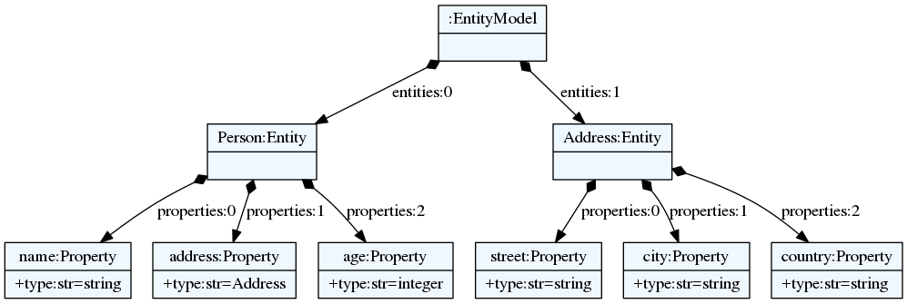
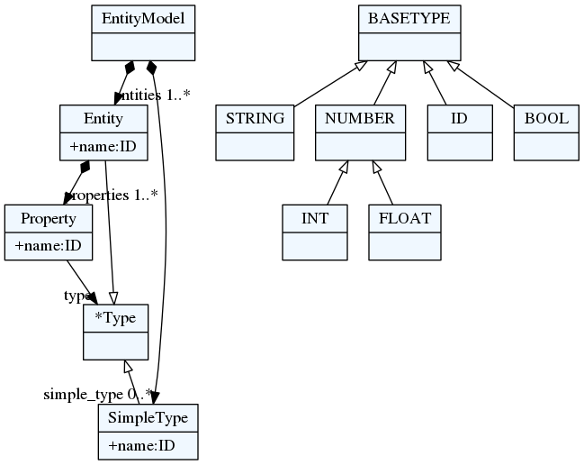

# Entity tutorial

A tutorial for building ER-like language and generating Java code.

---

!!! note "Work in progress"
    Will be done soon. In the meantime see [Entity example](https://github.com/igordejanovic/textX/tree/master/examples/Entity).

## Entity language

In this example we will see how to make a simple language form data modeling.
We will use this language to generate Java source code (POJO classes).

Our main concept will be `Entity`. Each entity will have one or more
`properties`.  Each property is defined by its `name` and its `type`.

Let's sketch out a model on our language.

    entity Person {
      name : string       
      address: Address   
      age: integer      
    }                  

    entity Address {
      street : string
      city : string
      country : string
    }

## The grammar

In our example we see that each entity starts with a keyword `entity`. After
that, we have a name that is identifier and open brace.
Inside braces we have properties. In textX this is written as:

    Entity:
        'entity' name=ID '{'
            properties+=Property
        '}'
    ;

We can see that the `Entity` rule references `Property` rule from the
assignment. Each property is defined by the `name`, semi-colon (`:`) and the
name of the type. This can be written as:

    Property:
        name=ID ':' type=ID
    ;

Now, grammar like this will parse a single `Entity`. We haven't stated yet that
that our model consists of many `Entity` instances.

Let's specify that. We are introducing rule for the whole model which states
that each entity model contains one or more `entities`.

    EntityModel:
        entities+=Entity
    ;

This rule must be first rule in the textX grammar file. First rule is always
considered a `root rule`.

This grammar will parse the example model from the beginning.

Meta-model now looks like this:

While the example Person model looks like this:

What you see on the model diagram are actual Python objects.
It looks good, but it would be even better if a reference to `Address` from
properties would be actual Python reference, not just a value of `str` type.

This resolving of object names to references can be done automatically by textX.
To do so we shall change our `Property` rule to be:

    Property:
        name=ID ':' type=[Entity]
    ;

Now, we state that type is a reference (we are using `[]`) to object of class
`Entity`. This instructs textX to search for the name of `Entity` after the 
colon and when found to resolve it to an `Entity` instance with the same name
defined elsewhere in the model.

But, we have problem now. There are no entities called `string` and `integer`
which we use for several properties in our model. To remedy this, we must 
introduce dummy entities with those names and change `properties` attribute
assignment to be `zero or more` (`*=`) since our dummy entities will have no
attributes.

Although, this solution is possible it wouldn't be elegant at all. So let's
do something better. First, let's introduce an abstract concept called `Type`
which will be generalization of simple types (like `integer` and `string`) and
complex types (like `Entity`).

    Type:
      SimpleType | Entity 
    ;

This is called abstract rule, and it means that `Type` is either `SimpleType`
or `Entity` instance. `Type` class from the meta-model will never be
instantiated.

Now, we shall change our `Property` rule definition:

    Property:
        name=ID ':' type=[Type]
    ;

And, at the end, there must be a way to specify our simple types. Let's do that
at the beginning of our model.

    EntityModel:
        simple_types *= SimpleType
        entities += Entity
    ;

And the definition of `SimpleType` would be:

    SimpleType:
      'type' name=ID
    ;

So, simple types are defined at the beginning of the model using keyword `type`
after which we specify the name of the type.

Our person model will begin now with:

    type string
    type integer

    entity Person {
    ...

Meta-model now looks like this:

While the example Person model looks like this:

