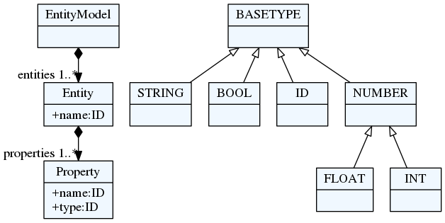
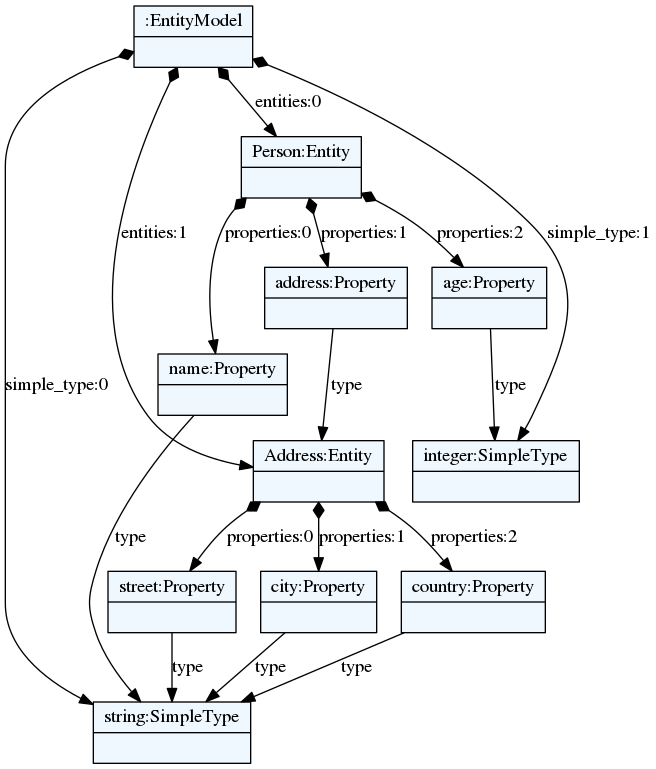

# Entity tutorial

A tutorial for building ER-like language and generating Java code.

---

## Entity language

In this example we will see how to make a simple language form data modeling.
We will use this language to generate Java source code (POJO classes).

Our main concept will be `Entity`. Each entity will have one or more
`properties`.  Each property is defined by its `name` and its `type`.

Let's sketch out a model on our language.

    entity Person {
      name : string       
      address: Address   
      age: integer      
    }                  

    entity Address {
      street : string
      city : string
      country : string
    }

## The grammar

In our example we see that each entity starts with a keyword `entity`. After
that, we have a name that is identifier and open brace.
Inside braces we have properties. In textX this is written as:

    Entity:
        'entity' name=ID '{'
            properties+=Property
        '}'
    ;

We can see that the `Entity` rule references `Property` rule from the
assignment. Each property is defined by the `name`, semi-colon (`:`) and the
name of the type. This can be written as:

    Property:
        name=ID ':' type=ID
    ;

Now, grammar like this will parse a single `Entity`. We haven't stated yet that
that our model consists of many `Entity` instances.

Let's specify that. We are introducing rule for the whole model which states
that each entity model contains one or more `entities`.

    EntityModel:
        entities+=Entity
    ;

This rule must be first rule in the textX grammar file. First rule is always
considered a `root rule`.

This grammar will parse the example model from the beginning.

Meta-model now looks like this:

While the example Person model looks like this:

What you see on the model diagram are actual Python objects.
It looks good, but it would be even better if a reference to `Address` from
properties would be actual Python reference, not just a value of `str` type.

This resolving of object names to references can be done automatically by textX.
To do so we shall change our `Property` rule to be:

    Property:
        name=ID ':' type=[Entity]
    ;

Now, we state that type is a reference (we are using `[]`) to object of class
`Entity`. This instructs textX to search for the name of `Entity` after the 
colon and when found to resolve it to an `Entity` instance with the same name
defined elsewhere in the model.

But, we have problem now. There are no entities called `string` and `integer`
which we use for several properties in our model. To remedy this, we must 
introduce dummy entities with those names and change `properties` attribute
assignment to be `zero or more` (`*=`) since our dummy entities will have no
attributes.

Although, this solution is possible it wouldn't be elegant at all. So let's
do something better. First, let's introduce an abstract concept called `Type`
which will be generalization of simple types (like `integer` and `string`) and
complex types (like `Entity`).

    Type:
      SimpleType | Entity 
    ;

This is called abstract rule, and it means that `Type` is either `SimpleType`
or `Entity` instance. `Type` class from the meta-model will never be
instantiated.

Now, we shall change our `Property` rule definition:

    Property:
        name=ID ':' type=[Type]
    ;

And, at the end, there must be a way to specify our simple types. Let's do that
at the beginning of our model.

    EntityModel:
        simple_types *= SimpleType
        entities += Entity
    ;

And the definition of `SimpleType` would be:

    SimpleType:
      'type' name=ID
    ;

So, simple types are defined at the beginning of the model using keyword `type`
after which we specify the name of the type.

Our person model will begin now with:

    type string
    type integer

    entity Person {
    ...

Meta-model now looks like this:

While the example Person model looks like this:

But, we can make this language even better. We can define some built-in simple
types so that the user does not need to specify them for every model. This has
to be done from python during meta-model instantiation. We can instantiate
`integer` and `string` simple types and introduce them in every model
programmatically.

First problem is how to instantiate `SimpleType` class. textX will dynamically
create Python class for each rule from the grammar but we do not have access
to these classes in advance.

Luckily, textX offers a way to override dynamically created classes with user
supplied ones. So, we can create our class `SimpleType` and register that class
during meta-model instantiation together with two its instances (`integer` and
`string`).

    class SimpleType(object):
      def __init__(self, parent, name):  # remember to include parent param.
        self.parent = parent
        self.name = name

Now, we can make a dict of builtin objects.

  myobjs =  {
    'integer': SimpleType(None, 'integer')
    'string': SimpleType(None, 'string')
  }

And register our custom class and two builtins on the meta-model:

    meta = metamodel_from_file('entity.tx', 
                               classes=[SimpleType],
                               builtins=myobjs)

Now, if we use `meta` to load our models we do not have to specify `integer` and
`string` types. Furthermore, each instance of `SimpleType` will be an instance
of our `SimpleType` class.

We, can use these custom classes support to implement any custom behaviour in
our object graph.

## Generating source code

textX doesn't impose any specific library or process for source code generation.
You can use anything you like. From `print` function to template engines.

I highly recommend you to use some of well established [template
engines](https://en.wikipedia.org/wiki/Template_processor).

Here, we will see how to use [Jinja2 template engine](http://jinja.pocoo.org/)
to generate Java source code from our entity models.

First, install jinja2 with pip:

    $ pip install Jinja2

Now, for each entity in our model we will render one Java file with getters and
setters rendered for each property.

Let's write Jinja2 template (file `java.template`):

    // Autogenerated from java.template file
    class {{entity.name}} {

      
      protected {{property.type|javatype}} {{property.name}};
      

      
      public {{property.type|javatype}} get_{{property.name}}(){
        return this.{{property.name}};
      }

      public void set_{{property.name}}({{property.type|javatype}} new_value){
        this.{{property.name}} = new_value;
      }
      

    }

Templates have static parts that will be rendered as is, and variable parts 
whose content will came from the model. Variable parts are written inside
`{{}}`. For example `{{entity.name}}` from the second line is the name of
the current entity.

The logic of rendering is controlled by `tags` written in `` (e.g. loops,
conditions).

We can see that this template will render a warning that this is auto-generated
code (it is always good to do that!). Than it will render Java class named after
the current entity and than, for each property in the entity (please note that
we are using textX model so all attribute names come from the textX grammar) we
are rendering Java attribute and after that we are rendering getters and
setters.

You could notice that for rendering proper Java types we are using `|javatype`
expression. This is called `filter` in Jinja2. It works similar to `unix` pipes.
You have an object and you pass it to some filter. Filter will transform given
object to some other object. In this case `javatype` is a simple python function
that will transform our types (`integer` and `string`) to proper Java types
(`int` and `String`).

Now, let's see how can we put this all together. We need to initialize Jinja2
engine, instantiate our meta-model, load our model and than iterate over 
entities from our model and generate Java file for each entity:

    from os import mkdir
    from os.path import exists, dirname, join
    import jinja2

    class SimpleType(object):
        def __init__(self, parent, name):
            self.parent = parent
            self.name = name

        def __str__(self):
            return self.name

    def get_entity_mm():
        """
        Builds and returns a meta-model for Entity language.
        """
        type_builtins = {
                'integer': SimpleType(None, 'integer'),
                'string': SimpleType(None, 'string')
        }
        entity_mm = metamodel_from_file(join(this_folder, 'entity.tx'),
                                        classes=[SimpleType],
                                        builtins=type_builtins,
                                        debug=debug)

    return entity_mm

    def main(debug=False):

        this_folder = dirname(__file__)

        # Instantiate Entity meta-model
        entity_mm = get_entity_mm(debug)

        def javatype(s):
            """
            Maps type names from SimpleType to Java.
            """
            return {
                    'integer': 'int',
                    'string': 'String'
            }.get(s.name, s.name)

        # Create output folder
        srcgen_folder = join(this_folder, 'srcgen')
        if not exists(srcgen_folder):
            mkdir(srcgen_folder)

        # Initialize template engine.
        jinja_env = jinja2.Environment(
            loader=jinja2.FileSystemLoader(this_folder))

        # Register filter for mapping Entity type names to Java type names.
        jinja_env.filters['javatype'] = javatype

        # Load Java template
        template = jinja_env.get_template('java.template')

        # Build Person model from person.ent file
        person_model = entity_mm.model_from_file(join(this_folder, 'person.ent'))

        # Generate Java code
        for entity in person_model.entities:
            # For each entity generate java file
            with open(join(srcgen_folder,
                          "%s.java" % entity.name.capitalize()), 'w') as f:
                f.write(template.render(entity=entity))

    if __name__ == "__main__":
        main()

