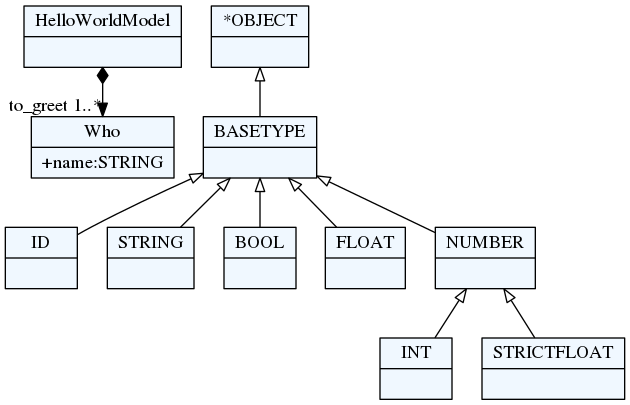
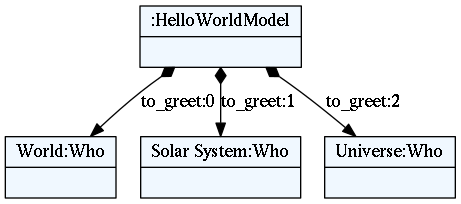

# Hello World example

This is an example of a very simple Hello World like language.

---

These are the steps to build a very basic Hello World - like language.

1. Write a language description in textX. Create a file called `hello.tx` in the
   text editor of your choice and type in the following:

        HelloWorldModel:
          'hello' to_greet+=Who[',']
        ;

        Who:
          name = /[^,]*/
        ;

    Description consists of a set of parsing rules which at the same time
    describe Python classes that will be dynamically created and used to
    instantiate objects of your model.  This small example consists of two
    rules: `HelloWorldModel` and `Who`.  `HelloWorldModel` starts with the
    keyword `hello` after which one or more `Who` objects must be written and
    separated with commas. `Who` objects will be parsed, instantiated and
    stored in a `to_greet` list on a `HelloWorldModel` object. `Who` objects
    consist only of their names which must match the regular expression rule
    `/[^,]*/` (match non-comma zero or more times). Please see [textX
    grammar](../grammar.md) section for more information on writing grammar
    rules.

2. To create the meta-model from textX language description, create a python
   file called `hello.py` in the same folder where your grammar is and type in
   the following:

        from textx.metamodel import metamodel_from_file
        hello_meta = metamodel_from_file('hello.tx')

    This will import the function `metamodel_from_file` from the textX library.
    This function is used then to load the grammar from `hello.tx` file and
    to create meta-model object. This object will be refered by the variable
    `hello_meta`.

3. Optionally, export the meta-model to dot to visualize your language's
   abstract syntax.

    The easiest way to visualize the grammar/meta-model is to use `textx`
    command from the command shell:

        $ textx visualize hello.tx
        Meta-model OK.
        Generating 'hello.tx.dot' file for meta-model.
        To convert to png run 'dot -Tpng -O hello.tx.dot'

    This command will check the grammar and create `hello.tx.dot`. Dot files
    can be viewed by dot viewers or converted to image formats by `dot`
    command.  More information is available in the [visualization
    section](../visualization.md).

    Alternatively you could done the same by using textX API from Python.
    Open your `hello.py` and add the following:

        from textx.export import metamodel_export
        metamodel_export(hello_meta, 'hello.tx.dot')

    Executing your Python code you will get the same `hello.tx.dot` file.

    Rendering this `dot` file either by using dot viewer or by converting it to
    some other image format you will get this:

    

    You can see that for each rule from the language description an appropriate
    Python class was created. A BASETYPE hierarchy is built-in. Each
    meta-model has it.

4. Create some content (i.e. model) in your new language. Create file
   `example.hello`, open it up in textual editor and type the following:

        hello World, Solar System, Universe

    Your language syntax is also described by the language rules from step 1.

    If we break down the text of the example model it looks like this:

    

    We see that the whole line is a `HelloWorldModel` and the parts `World`, 
    `Solar System`, and `Universe` are `Who` objects. Red coloured text is
    syntactic noise that is needed by the parser (and programmers) to recognize
    the boundaries of the objects in the text.

5. Use meta-model to create models from a textual description. In your Python
   `hello.py` file add this:

        example_hello_model = hello_meta.model_from_file('example.hello')

    Textual model ‘example.hello’ will be parsed and transformed to a plain
    Python object graph. Object classes are those defined by the meta-model.

6. To see your model you can export it to `dot` file. Again, we can do that by
   using `textx` command or by using textX API.

        $ textx visualize hello.tx example.hello
        Meta-model OK.
        Model OK.
        Generating 'hello.tx.dot' file for meta-model.
        To convert to png run 'dot -Tpng -O hello.tx.dot'
        Generating 'example.hello.dot' file for model.
        To convert to png run 'dot -Tpng -O example.hello.dot'

    Or, for using textX API, add this to `hello.py` file:

        from textx.export import model_export
        model_export(example_hello_model, 'example.hello.dot')

    Now, use `dot` command to convert to some image format or open `dot` file
    directly in dot viewer.

    File `example.hello.dot` will render like this:

    

    This is an object graph automatically constructed from `example.hello`
    file.

    We see that each `Who` object is contained in the python attribute
    `to_greet` of list type which is defined by the grammar.

7. Use your model: interpret it, generate code … It is a plain Python
   graph of objects with plain attributes!

!!! note
    Check out a [complete tutorial](robot.md) for building a simple robot language.
